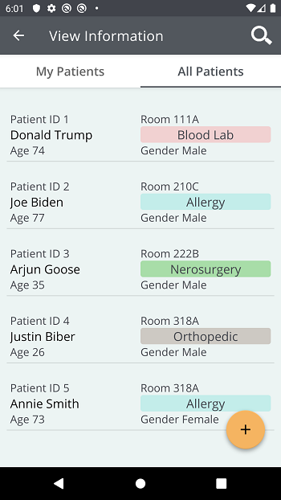

# eHeath Application
## Lushi Cao 301011302

### Name
eHeath Application

### Description
This is a health application for health care providers to manage patient and patient test data.

### Main functionalities
* Add patients
* Add clinical data
* Search patient record by patient ID
* Filter patients by department
* Swipe delete clinical data
* View all tests under each patient

### Support
Contact: lcao42@my.centennialcollege.ca

### Screens

